<div align="center">



<a href="https://git.io/typing-svg">
  
</a>

<br />

<a href="https://lorenzoairoldi-lab.github.io/Portfolio"></a>
<a href="https://www.linkedin.com/in/lorenzo-airoldi"></a>
<a href="mailto:lorenzo.airoldi17@gmail.com"></a>

</div>

## `> whoami`

```console
lorenzo@cloud-node:~$ ./profile --status

NAME       Lorenzo Airoldi
ROLE       Cloud Specialist in training
LOCATION   Turin, Italy
MISSION    Build secure, repeatable and resilient infrastructure
STATUS     AZ-104 loading...
```

I turn cloud concepts into hands-on projects. My path combines **Microsoft Azure**, **DevOps**, infrastructure automation, Linux administration and networking—with a strong preference for learning by building.

- ☁️ Studying Cloud Computing at **ITS ICT Piemonte**
- ⚙️ Exploring automation, CI/CD and **Infrastructure as Code**
- 🐧 Working across Linux systems, containers and networks
- 🔐 Designing with reliability and security in mind

## `> load_stack --matrix`

<div align="center">

### Cloud & DevOps


### Systems & Development


`Linux administration` · `Networking` · `REST APIs` · `Scripting` · `Automation`

</div>

## `> ls featured_projects/`

| Project | What lives inside | Signal |
| :--- | :--- | :---: |
| [**Portfolio**](https://github.com/lorenzoairoldi-lab/Portfolio) | Interactive Cloud Engineering portfolio built with vanilla HTML, CSS and JavaScript. | `LIVE` |
| [**Projects**](https://github.com/lorenzoairoldi-lab/Projects) | A curated collection of hands-on projects developed to sharpen technical skills. | `BUILDING` |
| [**Tool**](https://github.com/lorenzoairoldi-lab/Tool) | DevOps, Linux, Docker and system administration guides and quick references. | `OPEN` |

## `> cat certifications.log`

```text
[OK]       Agile Scrum Basic
[OK]       Linux Essentials
[OK]       CCNA: Introduction to Networks
[OK]       Claude 101
[RUNNING]  Microsoft Azure Administrator · AZ-104
[QUEUED]   HashiCorp Terraform Associate
```

## `> monitor --github`

<div align="center">


<picture>
  <source media="(prefers-color-scheme: dark)" srcset="https://github-readme-streak-stats-eight.vercel.app?user=lorenzoairoldi-lab&hide_border=true&background=000000&ring=00FF41&fire=39FF88&currStreakLabel=00FF41&sideLabels=8BFFAD&currStreakNum=FFFFFF&sideNums=FFFFFF&dates=4FA966" />
  
</picture>

<br />


### Contribution stream

<picture>
  <source media="(prefers-color-scheme: dark)" srcset="https://raw.githubusercontent.com/lorenzoairoldi-lab/lorenzoairoldi-lab/output/github-contribution-grid-snake-dark.svg" />
  <source media="(prefers-color-scheme: light)" srcset="https://raw.githubusercontent.com/lorenzoairoldi-lab/lorenzoairoldi-lab/output/github-contribution-grid-snake.svg" />
  
</picture>

</div>

---

<div align="center">

```text
There is no cloud. It's just someone else's computer — so automate it well.
```


</div>
